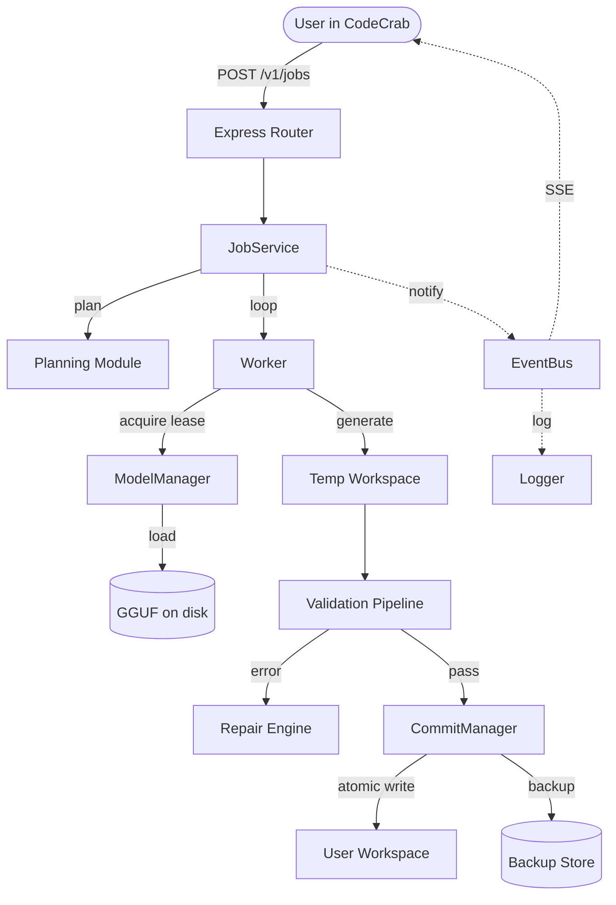

# CodeCrab — Improvement Plan

A prioritized roadmap of improvements, grouped into 4 phases. Each phase is independently shippable — later phases assume earlier ones are done. Phases are ordered by **value-to-effort ratio**, not by technical depth.

> **Revision history**
> - 2026-08-25 — original draft
> - 2026-08-25 — Section 1.1 revised. The original "shim then delete the legacy planner/rag" plan was found to be unsafe after a deep read. The legacy and new modules are not true duplicates — the new ones are byte-for-byte extractions with the data tables re-declared. The full revised plan is in [`PHASE_1_1_REVISED.md`](PHASE_1_1_REVISED.md:1). Summary: 3 sub-tasks (1.1a single source of truth, 1.1b extract `getAllCodeFiles`, 1.1c decide Tier-1 RAG fate) over 3–5 days.

---

## Phase 1 — Finish what was started (1–2 weeks, high value, low risk)

These are things the original author has already acknowledged need to happen. Doing them removes the biggest code smell (duplication) and unblocks everything else.

### 1.1 Reconcile the legacy `src/planner.ts` and `src/rag.ts` with their new modules

> **See [`PHASE_1_1_REVISED.md`](PHASE_1_1_REVISED.md:1) for the full plan.** What follows is the executive summary.

The legacy [`router/src/planner.ts`](router/src/planner.ts:1) and the newer [`router/src/planning/`](router/src/planning/) modules are not true duplicates. The new modules were extracted as byte-for-byte copies (per their own header comments), with the data tables (`LAYER_STAGE`, `ARCH_TEMPLATES`, `SHARED_FILES`, `LAYER_IMPORTS`) re-declared in the new files rather than imported. There are now two parallel copies of the same constants — they could drift. Similarly, [`router/src/rag.ts`](router/src/rag.ts:1) is still genuinely used by the legacy `POST /v1/chat/completions` path and by the Tier-2 RAG's `getAllCodeFiles` utility.

**Three sub-tasks** (revised plan in [`PHASE_1_1_REVISED.md`](PHASE_1_1_REVISED.md:1)):

- **1.1a** Create [`router/src/planning/templates.ts`](router/src/planning/templates.ts:1) as the single source of truth for the data tables, expand [`router/src/core/types.ts`](router/src/core/types.ts:102) `FileNode` to its rich shape (regain `stage`, `validationOrder`, `committedContent`), re-point both old and new modules to import from `templates.ts`, then migrate the 2 high-risk call sites (`index.ts`, `incrementalEngine.ts`) and 5 type-only call sites to the new module
- **1.1b** Extract `getAllCodeFiles` and friends to [`router/src/workspace/fileScanner.ts`](router/src/workspace/fileScanner.ts:1), update the 4 Tier-2 consumers and [`router/src/rag/index.ts`](router/src/rag/index.ts:27)
- **1.1c** Out of scope for Phase 1.1 — the Tier-1 RAG fate is tracked separately per [`router/src/migration/REMOVAL_MILESTONE.md`](router/src/migration/REMOVAL_MILESTONE.md:1)

**Definition of done** (from [`PHASE_1_1_REVISED.md`](PHASE_1_1_REVISED.md:1)):
- `git grep "from .*planner\.js"` returns zero hits in `router/src/` (after shim period)
- `git grep "from .*rag\.js"` returns only `migration/` and `index.ts`'s legacy chat path
- `npx tsc --noEmit` passes
- Manual smoke test: `POST /v1/jobs` end-to-end, and `POST /v1/chat/completions` still works
- Legacy `planner.ts` deleted after a 1-week shim with zero new callers

### 1.2 Finish the `migration/` removal

[`router/src/migration/REMOVAL_MILESTONE.md`](router/src/migration/REMOVAL_MILESTONE.md:1) lists three conditions; check them and act:
- [ ] `POST /v1/chat/completions` routes through `JobService` internally
- [ ] All clients use `POST /v1/jobs`
- [ ] No file in `src/` imports from `migration/`

If 1 and 2 are done, only step 3 is left. If 1 is not done, that's a known gap in the new pipeline that needs documenting. **Note:** this task depends on Phase 2.2 (editor webview) shipping first, since otherwise no client will be using `POST /v1/jobs` exclusively.

### 1.3 Break up `index.ts` (3,806 lines)

Even with extraction in progress, the file is still the de-facto entry point. Suggested split:

| Current block (in `index.ts`)       | New module                              |
|------------------------------------|------------------------------------------|
| Constraint parser (lines 38–62)    | `src/parsing/constraintParser.ts`        |
| PlannerContract builder (78–155)   | `src/parsing/plannerContract.ts`         |
| Repair modes & classifier (181–)   | `src/repair/repairModes.ts`              |
| HTTP route definitions             | `src/router/` (already exists)           |
| Bootstrap (Express app, EventBus)  | `src/server.ts`                          |

A soft target: no file in `src/` should exceed 800 lines.

### 1.4 Tighten `tsconfig.json`

[`router/tsconfig.json`](router/tsconfig.json:1) is strict (`noUncheckedIndexedAccess`, `exactOptionalPropertyTypes`) but leaves `noUnusedLocals`, `noUnusedParameters`, `noImplicitReturns`, and `noFallthroughCasesInSwitch` commented out. Turn them on — they catch dead code paths, which matter in a code-generation tool where a missed branch equals silently wrong output.

---

## Phase 2 — Make it usable (2–4 weeks, high value, medium risk)

Right now the project works only for the original author. Phase 2 is about making it work for a stranger.

### 2.1 First-run setup wizard

A new contributor should be able to go from `git clone` to "the router is processing my first job" in under 10 minutes.

Add `npm run setup` in the router, which walks through:
1. **Model selection** — list models found in `models/base/` and `models/adapters/`, let user pick which is advisor / backend / frontend / embedding
2. **Path confirmation** — show resolved absolute paths, confirm
3. **GPU layer config** — currently hardcoded to `'auto'` in [`modelManager.ts:63`](router/src/models/modelManager.ts:63). Expose it
4. **Workspace root** — ask once, write to `config.local.ts`
5. **Smoke test** — submit a trivial job ("create a hello world Express server") and verify it commits a file

If the user already has `config.local.ts`, the wizard skips the steps that are filled in.

### 2.2 Editor-side UI (the missing 50%)

The VS Code fork is a stock `code-oss` rebrand. None of the router's HTTP API is actually wired into the editor. Build a Webview-based extension that lives inside `vscode/extensions/codecrab/`:

**Layout:**
```
┌─ CodeCrab ────────────────────────────┐
│  [chat input]                         │
│  ────────────────────────────────     │
│  🟢 advisor model idle                │
│  ────────────────────────────────     │
│  Job j_a3f2c1b8 — running             │
│   ⏳ src/routes/auth.routes.ts  (2/8) │
│   ✅ src/middleware/jwt.ts            │
│   ❌ src/services/auth.service.ts     │
│       └─ [retry] [skip] [view log]    │
│  ────────────────────────────────     │
│  [cancel job]   [open workspace]      │
└───────────────────────────────────────┘
```

**Implementation sketch:**
- `vscode/extensions/codecrab/src/extension.ts` — registers the webview, status bar item
- `vscode/extensions/codecrab/src/apiClient.ts` — thin `fetch` wrapper over `POST /v1/jobs`, `GET /v1/jobs/:id`, `GET /v1/jobs/:id/events` (consume the JSONL line by line as an SSE stream)
- `vscode/extensions/codecrab/src/webview/index.html` + a small React/Vanilla view

Add to root `package.json`:
```json
"extensionDependencies": ["vscode.codecrab"]
```

### 2.3 Test the core pipeline

The router has no tests for the thing that actually matters: the job pipeline. Add `vitest` (or `node:test` since you're on Node 22) and cover at least:

| Test | What it verifies |
|------|------------------|
| `planner.test.ts` | Given an `AdvisorV2Result`, builds the right graph (layer order, deps, topological stages) |
| `dependencyAnalyzer.test.ts` | Detects cycles, returns next-ready node correctly |
| `validationPipeline.test.ts` | Mocks the LLM, feeds bad output, verifies repair loop runs N times then fails |
| `commitManager.test.ts` | Atomic write + backup is actually atomic (kill mid-write, verify backup intact) |
| `modelManager.test.ts` | Lease lifecycle, idle timer only fires with 0 leases, refuse-to-unload guard |
| `jobService.test.ts` | End-to-end with all subsystems mocked: `create → run → cancel → resume` |

**Why this matters specifically here:** a code-generation tool that silently produces broken TypeScript is worse than one that fails. Tests are how you prove the validation gate actually catches what it claims to catch.

### 2.4 Eval fixtures

A "test" of an LLM tool is not the same as a "test of the code." You need a small benchmark.

Create `router/evals/`:
```
evals/
├── cases/
│   ├── 001-hello-express/        # prompt: "build a hello world express server"
│   │   ├── prompt.txt
│   │   └── expected/
│   │       ├── src/server.ts
│   │       └── package.json
│   ├── 002-jwt-auth/             # prompt: "add JWT auth to existing users module"
│   └── ...
├── run.ts                        # runs all cases, scores pass/fail
└── README.md                     # how to add a new case
```

A case "passes" if:
1. All `expected/` files exist after generation
2. The files compile (`tsc --noEmit`)
3. No validation issues of severity `error`

Run on every PR, track over time. Without this, you can't tell if a refactor improved or regressed the system.

---

## Phase 3 — Make it correct (4–8 weeks, medium value, medium-high risk)

These are correctness and robustness improvements that the current implementation hints at but doesn't finish.

### 3.1 Model resolution — make the 4-model requirement less brittle

Current code in [`modelManager.ts:60`](router/src/models/modelManager.ts:60) requires loading 4 separate GGUF files. For most users this is a non-starter (16–32 GB VRAM, hard to find Qwen-specialist models, etc.). Options:

- **Model merging / role-prompting** — one base model + different system prompts per role. Drops VRAM by 4×. Quality may dip for specialist tasks, but is acceptable for many
- **Lazy loading + warm cache** — load advisor once, then on first `be` request swap to backend model. Already implemented; could add a model-warmup step on boot
- **Quantization auto-suggest** — if the user has a `qwen2.5-coder-7b-instruct-q4_k_m.gguf`, suggest it for all four roles with appropriate prompts
- **Local model registry** — replace Google Drive with a small `models.json` index that points to Hugging Face URLs, with checksums

### 3.2 Prompt safety / output parsing

The current `outputParser.ts` is the implicit contract between LLM output and the file system. Things that should be hardened:

- **Detect prompt-injection** in the LLM output (the model writing `<system>` tags, attempting to override the system prompt, etc.) — refuse to commit if found
- **Path traversal guard** — model says "write to `../../../etc/passwd`" → reject
- **Hard size limit per file** — refuse to write files > N MB (currently a soft cap on tokens, but no post-parse size check)
- **Bounded repair loop** — currently bounded by `maxRepairAttempts` per file, but a single bad file can still consume hours. Add a wall-clock budget per file and per job

### 3.3 Concurrent jobs

The `ModelManager` lease pattern is designed for concurrency, but `JobService` runs jobs sequentially in its current form. Add:

- **Job queue** — `POST /v1/jobs` either starts immediately or queues (with `?priority=N` and a max-concurrent-jobs config)
- **Fair scheduling** — if a long job is running, short jobs shouldn't have to wait for the whole graph to finish
- **Pre-emption** — cancel-mid-generation, save state, allow resume

### 3.4 Workspace isolation

Right now the router writes into the user's actual `workspace.defaultRoot`. If a generation goes wrong, it can corrupt the user's existing code. Add:

- **Sandbox generation** — generate to a sibling temp dir, only merge on explicit `POST /v1/jobs/:id/accept`
- **Diff preview** — `GET /v1/jobs/:id/diff` returns a unified diff the user reviews before accepting
- **Auto-rollback** — if validation fails after commit, revert via the existing `CommitManager` backup store (the infrastructure is already there per [`router/src/commits/`](router/src/commits/))

The diff-preview feature is the single highest-leverage UX addition — it's what makes the tool feel safe to use on real codebases.

---

## Phase 4 — Make it shine (2–3 months, lower priority, high polish)

Once the above is solid.

### 4.1 Stream the events to the editor via SSE

`GET /v1/jobs/:id/events` returns JSONL. Make it a real SSE endpoint (`Content-Type: text/event-stream`) and add heartbeat pings every 15s. The editor extension then opens one stream per active job and never has to poll.

### 4.2 Architecture diagrams in the repo

The system has the bones of a great architecture diagram but it lives only in the author's head. Add `docs/ARCHITECTURE.md` with:



A second diagram for the RAG pipeline, a third for the model lifecycle, and you've saved every new contributor an hour of staring at the code.

### 4.3 Telemetry that's opt-in, local, and useful

The `Logger` already writes structured JSON. Add:

- **Local telemetry dashboard** — a `GET /v1/stats/jobs` endpoint that returns success rate, average time-per-stage, most-common validation issues
- **Per-job trace** — `GET /v1/jobs/:id/trace` returns the full timeline (when each node started, how many tokens, how many repair attempts, what failed)
- **Anonymous, opt-in crash reports** — only if the user enables it; never phone home by default

### 4.4 Cross-platform model registry

Replace the Google Drive link in the README with a small `models/registry.json` file that lists known-good models per role with download URLs and checksums. `npm run setup` then offers to download them. This converts the project from "works for the author" to "works for anyone with a Hugging Face account."

### 4.5 Community-facing docs

- `docs/CONTRIBUTING.md` — how to add a new architecture template, a new capability prompt, a new validation pass
- `docs/MODELS.md` — recommended models, expected VRAM, quantization choices
- `docs/TROUBLESHOOTING.md` — common failures (`config.local.ts missing`, model won't load, validation keeps failing) with fixes
- A `docs/GLOSSARY.md` — `AdvisorV2Result`, `ExecutionGraph`, `ValidationContract` are not standard terms; spell them out

---

## Quick reference — what to do first

| If you have…       | Do this                                                           |
|--------------------|-------------------------------------------------------------------|
| 1 hour             | Turn on the unused strict flags in `tsconfig.json`                |
| 1 day              | Phase 1.1b — extract `getAllCodeFiles` to `workspace/fileScanner` |
| 3–5 days           | Phase 1.1a — single source of truth for the planner               |
| 2 weeks            | Ship the editor webview extension                                  |
| 1 month            | Add the eval harness + run it before any future refactor          |
| 2 months           | Diff-preview + accept/rollback flow                                |

The single highest-leverage change is **3.4 (diff preview before commit)** — it transforms the tool from "AI that touches my code" to "AI I can review." Everything else is supporting infrastructure.

---

## What NOT to do

In rough priority order, these are tempting but low-value:

- **Don't build a cloud sync layer** — this is a local-first tool, that is its main selling point
- **Don't add a web UI** — the VS Code fork is already a web UI (workbench is HTML)
- **Don't rewrite the planner in another language** — it's a pure function, the language doesn't matter
- **Don't add a "bring your own OpenAI key" mode** — it contradicts the local-first promise
- **Don't chase multi-language support** — TypeScript-only is fine, the architecture templates are extensible when needed
