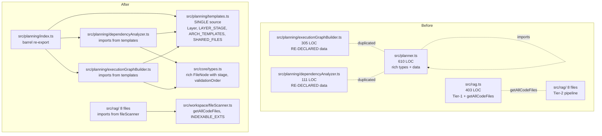

# CodeCrab — Revised Phase 1.1: Reconcile the Duplicated Planner & RAG Modules

> Status of this document: **supersedes Section 1.1 of [`plans/IMPROVEMENT_PLAN.md`](plans/IMPROVEMENT_PLAN.md:1)**
> Last updated: 2026-08-25, after a deep read of the legacy and new modules.

## TL;DR

The original Phase 1.1 plan assumed the legacy [`router/src/planner.ts`](router/src/planner.ts:1) and [`router/src/rag.ts`](router/src/rag.ts:1) were "true duplicates" of the newer [`router/src/planning/`](router/src/planning/) and [`router/src/rag/`](router/src/rag/) modules — implying a 1-day shim-then-delete refactor.

**That assumption is wrong.** The two pairs of files are in a more interesting state than a simple duplicate:

| Aspect | Legacy `src/planner.ts` (610 LOC) | New `src/planning/*` (305+111 LOC) |
|---|---|---|
| What it is | Original monorepo planner | **Byte-for-byte extraction** of sections of the legacy (see comments at `executionGraphBuilder.ts:5` and `dependencyAnalyzer.ts:3`) |
| Types | `FileNode`, `ExecutionGraph`, `Layer`, `FileNodeStatus`, `DependencyEdge` (rich, with `stage` and `validationOrder`) | `FileNode`, `ExecutionGraph`, `DependencyEdge` (slim, from [`core/types.ts`](router/src/core/types.ts:102)) — **re-declared in `executionGraphBuilder.ts:35` as a local `Layer` type** |
| Data tables | `LAYER_STAGE`, `LAYER_IMPORTS`, `ARCH_TEMPLATES`, `SHARED_FILES` (defined once) | **Same data, re-declared** at `executionGraphBuilder.ts:40,53,74,117` (defined twice) |
| Graph builders | `buildExecutionGraph`, `nextPendingNode`, `markNodeFailed`, `isGraphComplete`, `graphSummary`, `verifyGraph` | Same functions, but in two files. `buildExecutionGraph` lives in `executionGraphBuilder.ts`, the rest in `dependencyAnalyzer.ts` |
| Callers | 7 files | 1 file ([`router/src/jobs/jobService.ts`](router/src/jobs/jobService.ts:21)) |

**Implication:** there are now two parallel implementations of the same logic. They could drift, they double the maintenance burden, and they confuse new contributors who don't know which one to read.

The "shim then delete" plan is unsafe for two reasons:
1. Deleting the legacy `planner.ts` would remove the file that 7 other call sites import from. A pure re-export shim from the new module works *only if the type shapes match exactly* — they don't, because the new `core/types.ts` `FileNode` is a strict subset of the legacy one (no `stage`, no `validationOrder`).
2. The new `planning/` module's `buildExecutionGraph` produces a different output shape (e.g. it returns a `generationOrder: string[][]` instead of `FileNode[][]`, no `validationCheckpoints`, no `fromAdvisorV2` field). This was probably an oversight during the extraction.

So this is not a "delete a file" task. It's a "reconcile two divergent implementations" task — Phase 1.1 needs to be bigger and more careful.

---

## The real call-site map

### Files importing from legacy `./planner.js`

| File | What it imports | Risk |
|---|---|---|
| [`router/src/index.ts:17`](router/src/index.ts:17) | `buildExecutionGraph, nextPendingNode, isGraphComplete, graphSummary, markNodeFailed, AdvisorV2Result, ExecutionGraph` | High — uses 5 functions + 2 types. Index.ts is the monolith being broken up |
| [`router/src/incrementalEngine.ts:17-18`](router/src/incrementalEngine.ts:17) | `ExecutionGraph, FileNode, DependencyEdge, nextPendingNode, markNodeFailed, isGraphComplete, graphSummary, verifyGraph` | High — uses 6 functions + 3 types, and is the active engine path |
| [`router/src/dependencyStatus.ts:20`](router/src/dependencyStatus.ts:20) | `ExecutionGraph` (type only) | Low — type-only import |
| [`router/src/pipelineState.ts:13`](router/src/pipelineState.ts:13) | `AdvisorV2Result, ExecutionGraph` (types only) | Low — type-only import |
| [`router/src/repairEngine.ts:15`](router/src/repairEngine.ts:15) | `FileNode` (type only) | Low — type-only import |
| [`router/src/validator.ts:41`](router/src/validator.ts:41) | `ExecutionGraph` (type only) | Low — type-only import |
| [`router/src/workspaceSnapshot.ts:14`](router/src/workspaceSnapshot.ts:14) | `ExecutionGraph, FileNode` (types only, plus `FileNodeStatus` in a nested type at line 24) | Low — type-only import |

**Summary:** 4 low-risk (type-only) call sites and 2 high-risk ones (`index.ts`, `incrementalEngine.ts`). The two high-risk sites are the only ones that actually invoke runtime functions from the legacy planner.

### Files importing from legacy `./rag.js`

| File | What it imports | Risk |
|---|---|---|
| [`router/src/index.ts:11`](router/src/index.ts:11) | `em, indexWorkspace, updateFile, deleteFiles, syncWorkspace, retrieveContext, tableNameFor` (Tier-1 vector search) | High — used by the legacy `POST /v1/chat/completions` route that has not yet been migrated to the new `JobService` path (this is the `migration/` directory's whole reason for existing — see [`REMOVAL_MILESTONE.md`](router/src/migration/REMOVAL_MILESTONE.md:1)) |
| [`router/src/incrementalEngine.ts:23`](router/src/incrementalEngine.ts:23) | (re-exports `SymbolIndex, PromptCache` from `./symbolIndex.js`, not the legacy rag) | None — this is a different file |
| [`router/src/rag/astSearch.ts:11`](router/src/rag/astSearch.ts:11) | `getAllCodeFiles` | Low — single utility, used by 4 sibling files |
| [`router/src/rag/fileOwnership.ts:11`](router/src/rag/fileOwnership.ts:11) | `getAllCodeFiles` | Low |
| [`router/src/rag/importGraph.ts:12`](router/src/rag/importGraph.ts:12) | `getAllCodeFiles` | Low |
| [`router/src/rag/index.ts:27`](router/src/rag/index.ts:27) | `retrieveEmbeddingChunks` | Medium — last-step fallback in the Tier-2 pipeline |
| [`router/src/rag/symbolIndex.ts:11`](router/src/rag/symbolIndex.ts:11) | `getAllCodeFiles` | Low |

**Summary:** the legacy `src/rag.ts` is split into two groups: (a) Tier-1 vector helpers that exist for the not-yet-migrated `POST /v1/chat/completions` route, and (b) a small `getAllCodeFiles` utility that the Tier-2 pipeline genuinely depends on. The utility is the only thing that's safe to extract.

---

## Revised Phase 1.1 plan — 3 sub-tasks

### Sub-task 1.1a — Single source of truth for the planner (3–5 days)

**Goal:** get to one canonical `planner.ts` in `src/planning/`, used by everyone. The current "duplication" is in fact a re-declaration of the same data, which is the root of the drift risk.

**Steps:**

1. **Pick the canonical shape.** Decide whether to keep the rich types (with `stage`, `validationOrder`, `validationCheckpoints`, `fromAdvisorV2`) or the slim ones. Recommendation: **keep the rich types** — the slim ones lose information that the legacy `incrementalEngine` and `pipelineState` rely on. The new `core/types.ts` `FileNode` is too thin.

2. **Move the data tables to one file.** Create [`router/src/planning/templates.ts`](router/src/planning/templates.ts:1) with:
   - `Layer` type (the rich one, with `'config' | 'database' | ... | 'other'`)
   - `LAYER_STAGE`, `LAYER_IMPORTS`, `ARCH_TEMPLATES`, `SHARED_FILES` (extracted from the legacy file lines 117–222)
   - `PathTemplate` interface
   - `ArchKey` type
   - `buildFilePath(moduleName, layer, arch, ext)` helper

3. **Re-point the new modules at `templates.ts`.** In [`router/src/planning/executionGraphBuilder.ts`](router/src/planning/executionGraphBuilder.ts:1):
   - Delete the local `Layer` declaration (line 35)
   - Delete the local `LAYER_STAGE` (line 40), `LAYER_IMPORTS` (line 53), `ARCH_TEMPLATES` (line 74), `SHARED_FILES` (line 117) declarations
   - `import { Layer, LAYER_STAGE, LAYER_IMPORTS, ARCH_TEMPLATES, SHARED_FILES, buildFilePath } from './templates.js'`
   - Update internal usages to remove the now-unnecessary `as Layer` casts (which are no longer needed once the type is imported)

4. **Update the `FileNode` shape in [`router/src/core/types.ts`](router/src/core/types.ts:102).** Add back the `stage` and `validationOrder` fields (and the `committedContent` field that the legacy `FileNode` has). This is the actual root cause of the divergence: the new types were simplified but the old code kept using the rich fields.

5. **Re-point the legacy `planner.ts` at `templates.ts` too.** Same data-extraction, then delete lines 117–222 of the legacy file and add the import.

6. **Migrate the 2 high-risk call sites** (`index.ts`, `incrementalEngine.ts`) to import from `src/planning/`. At this point they can use the new module's exports directly because the types now match.

7. **Migrate the 5 type-only call sites** (`dependencyStatus.ts`, `pipelineState.ts`, `repairEngine.ts`, `validator.ts`, `workspaceSnapshot.ts`) to import from `src/planning/`.

8. **At this point, the legacy `planner.ts` is no longer imported by anything.** Add a deprecation shim that re-exports from the new module:
   ```ts
   // router/src/planner.ts — DEPRECATED, scheduled for removal
   import * as ns from './planning/index.js';
   console.warn('[DEPRECATED] src/planner.ts will be removed. Use src/planning/ instead.');
   export const { buildExecutionGraph, nextPendingNode, isGraphComplete, graphSummary, markNodeFailed, verifyGraph } = ns;
   export type { AdvisorV2Result, ExecutionGraph, FileNode, DependencyEdge, FileNodeStatus, Layer } from './planning/index.js';
   ```
   Wait at least 1 release cycle (or 1 week of dev time). Then delete the legacy file.

### Sub-task 1.1b — Extract the shared RAG utility (0.5 day)

**Goal:** move `getAllCodeFiles` (and the related `INDEXABLE_EXTS` / `RAG_SKIP_DIRS` constants) out of the legacy `rag.ts` into a shared utility, without touching the rest of Tier-1 yet.

**Steps:**

1. Create [`router/src/workspace/fileScanner.ts`](router/src/workspace/fileScanner.ts:1) with `getAllCodeFiles(dir, results?)`, `INDEXABLE_EXTS`, `RAG_SKIP_DIRS`.

2. In each of the 4 Tier-2 consumers ([`router/src/rag/astSearch.ts`](router/src/rag/astSearch.ts:11), [`fileOwnership.ts`](router/src/rag/fileOwnership.ts:11), [`importGraph.ts`](router/src/rag/importGraph.ts:12), [`symbolIndex.ts`](router/src/rag/symbolIndex.ts:11)), change:
   ```ts
   import { getAllCodeFiles } from '../rag.js';
   ```
   to:
   ```ts
   import { getAllCodeFiles } from '../workspace/fileScanner.js';
   ```

3. Same in [`router/src/rag/index.ts:27`](router/src/rag/index.ts:27) for `retrieveEmbeddingChunks` if it's a one-line wrapper — extract it too. Otherwise leave it for 1.1c.

4. In the legacy [`router/src/rag.ts`](router/src/rag.ts:146), replace the local `getAllCodeFiles` and constants with re-exports from the new file so anyone still importing the old path keeps working.

### Sub-task 1.1c — Decide the fate of Tier-1 RAG (separate ticket)

**Goal:** explicitly answer the question: do we keep Tier-1 RAG, replace it with Tier-2, or run both? This is the work tracked in [`router/src/migration/REMOVAL_MILESTONE.md`](router/src/migration/REMOVAL_MILESTONE.md:1) and is **out of scope for Phase 1.1** — but 1.1 cannot delete the legacy `rag.ts` until this is resolved.

**Steps:**

1. Open a new ticket titled "Migrate `POST /v1/chat/completions` to the new `JobService` path" (this is the first of the three conditions in [`REMOVAL_MILESTONE.md`](router/src/migration/REMOVAL_MILESTONE.md:1)).
2. Once that ticket is done, `indexWorkspace`, `updateFile`, `deleteFiles`, `syncWorkspace`, `retrieveContext`, `tableNameFor`, and `em` are no longer used by `index.ts`. They can be moved to a `legacy/rag-tier1.ts` file or deleted.
3. Then and only then can the legacy `router/src/rag.ts` be deleted.

---

## End-state diagram



## End-state file inventory (after 1.1a, 1.1b, 1.1c)

| File | Status | Action |
|---|---|---|
| [`router/src/planning/templates.ts`](router/src/planning/templates.ts:1) | NEW | Contains all the data tables |
| [`router/src/planning/executionGraphBuilder.ts`](router/src/planning/executionGraphBuilder.ts:1) | EDITED | Imports from `templates.ts`, drops local re-declarations |
| [`router/src/planning/dependencyAnalyzer.ts`](router/src/planning/dependencyAnalyzer.ts:1) | EDITED | Same |
| [`router/src/planning/index.ts`](router/src/planning/index.ts:1) | NEW | Barrel re-export so callers can `import { ... } from './planning'` |
| [`router/src/core/types.ts`](router/src/core/types.ts:102) | EDITED | `FileNode` regains `stage`, `validationOrder`, `committedContent` |
| [`router/src/planner.ts`](router/src/planner.ts:1) | DELETED (after 1-week shim) | Replaced by shim, then removed |
| [`router/src/workspace/fileScanner.ts`](router/src/workspace/fileScanner.ts:1) | NEW | `getAllCodeFiles` + constants |
| [`router/src/rag.ts`](router/src/rag.ts:1) | DELETED (after 1.1c) | Pending Tier-1 migration ticket |
| 6 call-site files | EDITED | Repointed to `planning/` and `workspace/fileScanner` |

## Risks and mitigations

| Risk | Likelihood | Mitigation |
|---|---|---|
| Type shape mismatch causes runtime crash after re-pointing call sites | High if not done carefully | Migrate one call site at a time, run `tsc --noEmit` between each |
| Legacy tests (none exist) don't catch the divergence | Certain | Add a `templates.test.ts` that asserts the data tables match the originals |
| Tier-2 RAG breaks after 1.1b because `getAllCodeFiles` has a subtle behavioral difference | Low | The function is small and pure; copy it verbatim, then add a test that walks a fixture tree |
| Forgetting to delete the shim, leaving dead code forever | Medium | Add a `// TODO: remove by YYYY-MM-DD` comment with a date 2 weeks out and a CI grep that fails if the shim is still present after that date |
| `core/types.ts` regaining `stage` / `validationOrder` breaks the new `planning/` module's callers | Medium | The new `JobService` only reads `nodes`, `generationOrder`, `architecture`, `framework`, `language`, `modules` — adding optional fields is non-breaking |

## What this sub-task does NOT do

- Does not migrate `POST /v1/chat/completions` to the new pipeline (that's 1.1c, a separate ticket)
- Does not delete the `migration/` directory
- Does not touch the 3,806-line [`router/src/index.ts`](router/src/index.ts:1) beyond changing the planner imports
- Does not add tests for the planner (separate work in Phase 2.3 of the original plan)
- Does not fix any of the other phases

## Definition of done

- [ ] `git grep "from .*planner\.js"` returns zero hits in `router/src/` (excluding `planner.ts` itself during the shim period, and excluding the `migration/` directory)
- [ ] `git grep "from .*rag\.js"` returns only `migration/` and `index.ts`'s legacy chat path
- [ ] `npx tsc --noEmit` passes
- [ ] Manual smoke test: submit a `POST /v1/jobs` with a real prompt, verify the job runs end-to-end
- [ ] Manual smoke test: submit a `POST /v1/chat/completions` request (the legacy path) and verify it still works
- [ ] Deprecation shim has been in place for at least 1 week with zero new callers
- [ ] Legacy `planner.ts` deleted
- [ ] `MIGRATION_1_1.md` written documenting what was done
